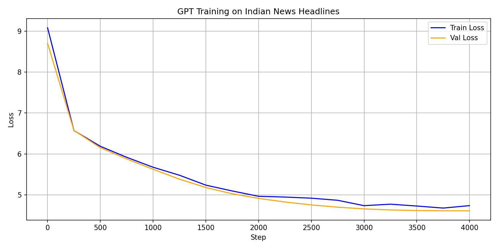

# GPT News Headline Generator

A GPT-2 style transformer language model built **from scratch** in PyTorch, trained on 150,000 Indian news headlines from the Times of India dataset (2001-2022).

## Features

- **Transformer architecture from scratch** — self-attention, multi-head attention, residual connections, layer normalization, all implemented manually in PyTorch (no `nn.Transformer`)
- **Custom BPE tokenizer** — ByteLevel BPE tokenizer trained on the corpus (vocab size 8,000), same approach as GPT-2
- **KV-caching** — key-value cache implemented in the attention module for efficient autoregressive inference
- **Custom sampling strategies** — temperature, top-k, and top-p (nucleus) sampling implemented from scratch
- **Cosine LR scheduling** — learning rate decays from 3e-4 to 0 over training
- **Gradient clipping** — prevents exploding gradients during training
- **Streamlit UI** — interactive demo with sliders for all generation parameters

## Model Architecture

| Parameter | Value |
|---|---|
| Parameters | 13.76M |
| Layers | 6 |
| Attention heads | 6 |
| Embedding dim | 384 |
| Context length | 128 tokens |
| Vocabulary size | 8,000 |
| Dropout | 0.2 |

## Training

Trained on Google Colab (T4 GPU) for 4,000 steps (~18 minutes).

**Hyperparameter ablation:** Two training runs were compared:
- Run 1 (dropout=0.1, weight_decay=0.01) — overfitting observed after step 3,000
- Run 2 (dropout=0.2, weight_decay=0.1) — overfitting eliminated, train/val curves remain close

**Final val loss: 4.61**



## Generated Examples

| Prompt | Generated |
|---|---|
| Modi | Modi: Foreign minister Naveen K Sarma... |
| RBI cuts | RBI cuts into 2nd year Row over N-deal... |
| Supreme Court | Supreme Court notice to Haryana govt for CBI probe... |

## Project Structure
gpt-news/

├── model/

│   ├── attention.py      # SelfAttention + MultiHeadAttention with KV-cache

│   ├── transformer.py    # TransformerBlock (pre-norm architecture)

│   └── gpt.py           # Full GPT model + generate() with sampling

├── data/

│   └── prepare.py       # HeadlineDataset + DataLoader

├── train.py             # Training loop with cosine LR + gradient clipping

├── inference.py         # Model loading + text generation

├── app.py              # Streamlit UI

└── bpe_tokenizer.json  # Trained BPE tokenizer

## Setup

```bash
pip install torch tokenizers streamlit
```

## Run Streamlit App

```bash
streamlit run app.py
```

## Key Design Decisions

**Why BPE over character-level tokenization?**
BPE compresses sequences 6x compared to character-level, allowing the model to attend over much more context within the same window size.

**Why KV-caching?**
During autoregressive generation, without caching, keys and values for all previous tokens are recomputed at every step — O(n²) cost. KV-cache stores them and only computes for the new token — O(n) cost. This is how production LLM serving works.

**Why top-p over top-k?**
Top-p is more adaptive — when the model is confident it naturally narrows options; when uncertain it keeps more options open. Top-k uses a fixed cutoff regardless of the probability distribution shape.

**Why pre-norm architecture?**
Applying LayerNorm before attention/feedforward (rather than after, as in the original 2017 paper) leads to more stable training gradients, especially in deeper networks.

## Dataset

[India News Headlines Dataset](https://www.kaggle.com/datasets/therohk/india-headlines-news-dataset) — Times of India headlines, 2001-2022 (CC0 license). 150,000 headlines sampled for training.
